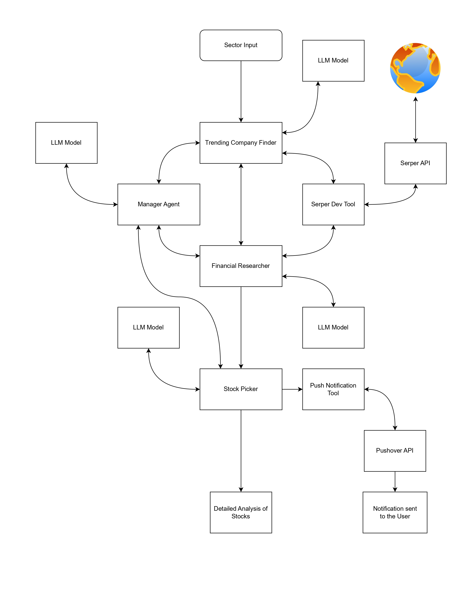

# 🤖 CrewAI Stock Picker - Financial Research System

A sophisticated multi-agent financial research system powered by CrewAI that identifies trending companies, conducts comprehensive financial analysis, and provides intelligent stock recommendations with automated notifications.

## 📊 System Overview

This project implements an intelligent financial research pipeline using multiple specialized AI agents working collaboratively to:

- **Identify trending companies** in user-specified sectors
- **Conduct deep financial analysis** using real-time data
- **Generate actionable stock recommendations**
- **Deliver automated push notifications** to keep you informed

## 🏗️ Architecture



*Multi-agent system architecture showing the complete financial research and stock analysis pipeline with integrated tools and APIs.*

## 🤖 AI Agents

### 1. **Trending Company Finder**
- Identifies emerging and trending companies within specified sectors
- Utilizes web search capabilities via Serper API
- Filters companies based on relevance and market momentum

### 2. **Manager Agent**
- Orchestrates the entire research workflow
- Coordinates between different agents
- Ensures quality control and process optimization

### 3. **Financial Researcher**
- Conducts comprehensive financial analysis
- Gathers real-time market data and company fundamentals
- Analyzes financial statements, ratios, and market trends

### 4. **Stock Picker**
- Evaluates analyzed companies for investment potential
- Generates buy/sell/hold recommendations
- Provides detailed reasoning for each recommendation

## 🛠️ Features

- **Multi-Agent Collaboration**: Specialized agents working together for comprehensive analysis
- **Real-time Data Integration**: Live market data via Serper API
- **Intelligent Stock Selection**: AI-powered investment recommendations
- **Automated Notifications**: Push notifications via Pushover for timely updates
- **Sector-Specific Analysis**: Targeted research based on industry sectors
- **Detailed Reporting**: Comprehensive analysis reports for each recommendation

## 🚀 Getting Started

### Prerequisites

- Python 3.8+
- CrewAI framework
- Required API keys (see Environment Setup)

### Project Creation (For Reference)

This project was created using CrewAI CLI:
```bash
# Create a new CrewAI project
crewai create crew VisionTrade

# Navigate to project directory
cd VisionTrade
```

### Installation

1. **Clone the repository**
   ```bash
   git clone https://github.com/shanks1554/VisionTrade.git
   cd VisionTrade
   ```

2. **Install CrewAI and dependencies**
   ```bash
   pip install crewai
   pip install -r requirements.txt
   ```

3. **Set up environment variables**
   Create a `.env` file in the root directory:
   ```env
   MODEL=gemini/gemini-2.5-pro-exp-03-25
   GEMINI_API_KEY=your_gemini_api_key_here
   SERPER_API_KEY=your_serper_api_key_here
   PUSHOVER_USER=your_pushover_user_key
   PUSHOVER_TOKEN=your_pushover_app_token
   PUSHOVER_URL=https://api.pushover.net/1/message.json
   ```

### Running the Application

1. **Direct Python execution**
   ```bash
   python src/stock_picker/financial_research_crew/main.py
   ```

2. **Using CrewAI CLI (Alternative)**
   ```bash
   # Run the crew from project root
   crewai run
   ```

### Interactive Usage

When you run the application, you'll be prompted to enter a sector:

```bash
=== Stock Picker - Financial Research System ===

Popular sectors: Technology, Energy, Healthcare, Finance, Consumer Goods
Enter the sector you want to analyze: Technology

🔍 Starting analysis for sector: Technology
📅 Analysis date: 2025-08-24 15:30:45
--------------------------------------------------
```

**Available Sectors:**
- Technology
- Energy 
- Healthcare
- Finance
- Consumer Goods
- Industrial
- Real Estate
- Utilities
- Materials
- Telecommunications
- Or any custom sector name

## 📁 Project Structure

```
stock-picker/
├── src/
│   └── stock_picker/
│       ├── __init__.py
│       ├── main.py
│       ├── crew.py
│       ├── agents.py
│       ├── tasks.py
│       └── tools/
│           ├── __init__.py
│           ├── serper_dev_tool.py
│           └── push_notification_tool.py
├── .env
├── .gitignore
├── pyproject.toml
├── requirements.txt
├── workflow.png
└── README.md
```


## ⚙️ Configuration

### Environment Variables

| Variable | Description | Required |
|----------|-------------|----------|
| `MODEL` | Gemini model specification | ✅ |
| `GEMINI_API_KEY` | Google Gemini API key | ✅ |
| `SERPER_API_KEY` | Serper search API key | ✅ |
| `PUSHOVER_USER` | Pushover user key for notifications | ✅ |
| `PUSHOVER_TOKEN` | Pushover application token | ✅ |
| `PUSHOVER_URL` | Pushover API endpoint | ✅ |

### API Key Setup

1. **Gemini API**: Get your key from [Google AI Studio](https://aistudio.google.com/)
2. **Serper API**: Register at [Serper.dev](https://serper.dev/)
3. **Pushover**: Create an account at [Pushover.net](https://pushover.net/)

## 📱 Notifications

The system sends automated push notifications via Pushover when:
- Financial analysis is completed
- Stock recommendations are generated

## 🔄 Workflow

### Using CrewAI CLI

1. **Initialize**: `crew run` starts the multi-agent workflow
2. **Input Processing**: Specify target sector for analysis (via CLI input or config)
3. **Agent Orchestration**: CrewAI manages agent communication and task delegation
4. **Company Discovery**: Trending Company Finder agent identifies prospects
5. **Financial Research**: Financial Researcher agent conducts deep analysis
6. **Stock Evaluation**: Stock Picker agent generates recommendations
7. **Notification Delivery**: Push Notification tool sends updates
8. **Report Generation**: Comprehensive analysis reports are produced

### Typical Usage

```bash
# Start the financial research workflow
python src/stock_picker/financial_research_crew/main.py

# The system will prompt for sector input interactively
# Example interaction:
# Enter the sector you want to analyze: Healthcare
```

**Current Features:**
- **Interactive Sector Selection**: Choose any sector via user prompt
- **Real-time Analysis**: Uses current timestamp for market analysis
- **One-Click Execution**: Single command runs complete analysis
- **Persistent Storage**: Results saved to `output/` directory
- **Memory Retention**: Agent learning stored in `memory/` directory
- **Knowledge Base**: Research data maintained in `knowledge/` directory
- **Comprehensive Output**: Detailed analysis with final investment decision

### File System Integration
- **Output Reports**: All analysis results are saved to `output/` folder
- **Agent Memory**: Learning and context stored in `memory/` for future runs
- **Knowledge Base**: Company and market data accumulated in `knowledge/` directory
- **Test Results**: Unit and integration test outputs in `tests/` folder

### Execution Details
- **Single Run**: One execution analyzes one sector completely
- **Search Operations**: ~15-25 API calls per analysis (handled internally)
- **Processing Time**: Typically 3-5 minutes depending on sector complexity
- **Output Format**: Structured analysis with clear final recommendations
- **Data Persistence**: All findings stored for future reference and learning

## 📊 Output Examples

The system generates:
- **Company Rankings**: Trending companies with momentum scores
- **Financial Reports**: Key metrics, ratios, and analysis
- **Investment Recommendations**: Buy/sell/hold with confidence levels
- **Risk Assessments**: Potential risks and opportunities
- **Final Decision**: Comprehensive conclusion displayed as "=== Final Decision ==="

## 🤝 Contributing

1. Fork the repository
2. Create a feature branch (`git checkout -b feature/AmazingFeature`)
3. Commit your changes (`git commit -m 'Add some AmazingFeature'`)
4. Push to the branch (`git push origin feature/AmazingFeature`)
5. Open a Pull Request

## 📄 License

This project is licensed under the MIT License - see the [LICENSE](LICENSE) file for details.

## ⚠️ Disclaimer

This tool is for educational and informational purposes only. It does not constitute financial advice. Always consult with qualified financial advisors before making investment decisions. The authors are not responsible for any financial losses incurred from using this software.

## 🔗 Links

- [CrewAI Documentation](https://docs.crewai.com/)
- [Gemini API](https://ai.google.dev/)
- [Serper API](https://serper.dev/api)
- [Pushover API](https://pushover.net/api)

## 📞 Support

For support, please open an issue in this repository or contact the maintainers.

---

**Made with ❤️ using CrewAI and AI agents**